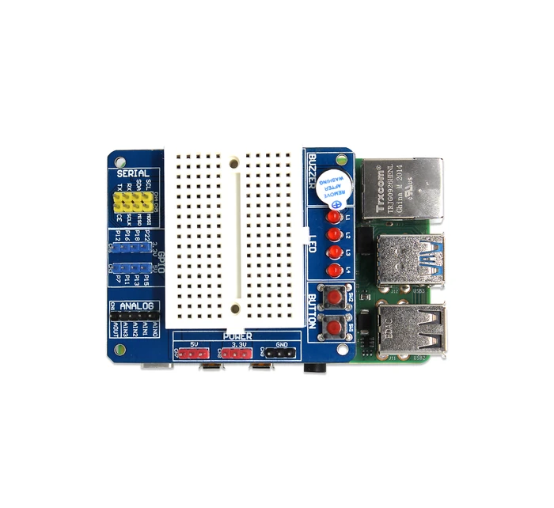

# BreadPi
BreadPi is a multi-purpose HAT(Hardware Attached on Top) that consists of a mini breadboard on top, ADC, a Programmable Buzzer, Programmable LEDs, push buttons, and 5V tolerant inputs at the Operating Voltage of 3.3V DC at a single place. SB Components developed BreadPi with advanced features like independently controllable LEDs, inputs(Analog & digital), a mini breadboard that helps the user to prototype their projects in an efficient way. 


## Installation Steps:

Install breadpi package on your Raspberry Pi using

`pip3 install breadpi`

or

`python3 -m pip install breadpi`


import the module with 

`from breadpi import BreadPi`


Access PCF8591 or GPIOs directly

```python
bread_pi = BreadPi()

data = bread_pi.read_analog(register=1)  #  Read Data from AIN1

bread_pi.write_analog(register=1, value=100)  #  Covert Digital data to analog
```

To use BreadPi LEDs and buzzer- 
```python
bread_pi = BreadPi()
#  To Turn On LEDs use led_on method
#  Use LED number as argument 
bread_pi.led_on('L1')
bread_pi.led_on('L2')
#  Or use Pin numbers
bread_pi.led_on(38)
bread_pi.led_on(40)

#  To Turn Off LEDs use led_off 
#  Use LED number as argument
bread_pi.led_off('L1')
bread_pi.led_off('L2')
#  Or Pin Number
bread_pi.led_off(38)
bread_pi.led_off(40)

#  To Turn On or Turn Off buzzer
#  Use buzzer_on, buzzer_off
bread_pi.buzzer_on()
bread_pi.buzzer_off()

```

or 

take digital inputs from buttons using button function of BreadPi class.

```python
bread_pi = BreadPi()
#  To use switches Of BreadPi
#  use btton function with pin number or switch number of BreadPi as args
status = bread_pi.button('SW1')
status = bread_pi.button(31)

```


You can pass string printed on BreadPi like, 'L1' or 'SW1' or customized pin number like 29, 31 directly to the functions. 

### Video Tutorial

<div align="center">
      <a href="https://www.youtube.com/watch?v=Wb4c5ab5QEw">
     
      </a>
    </div>
